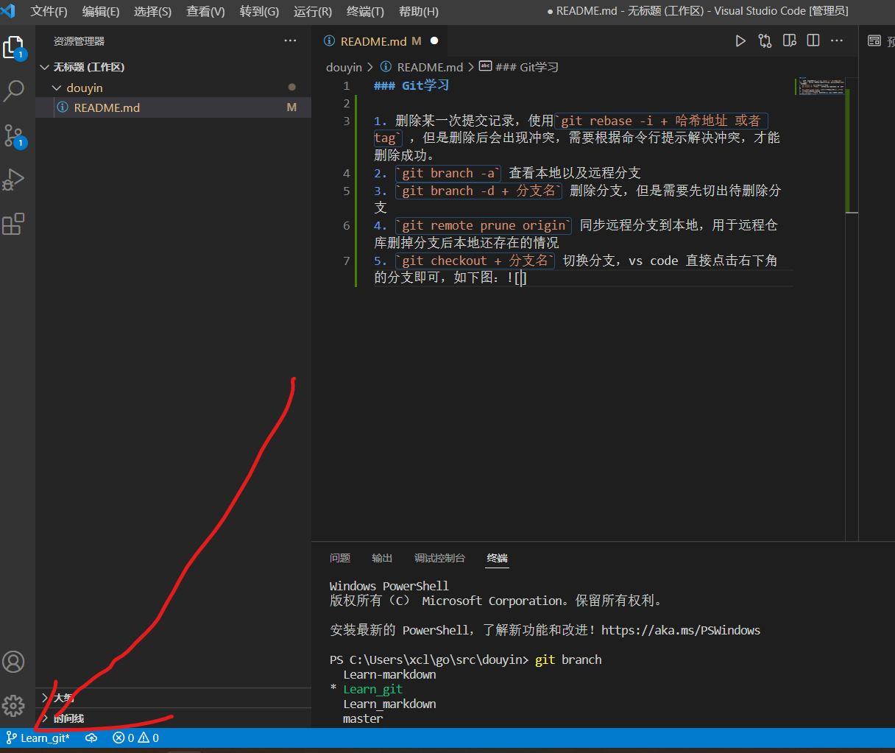
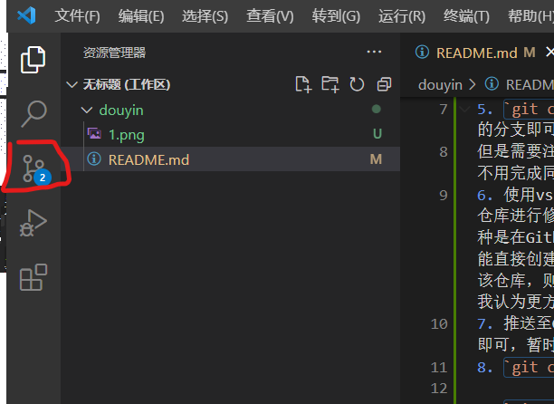
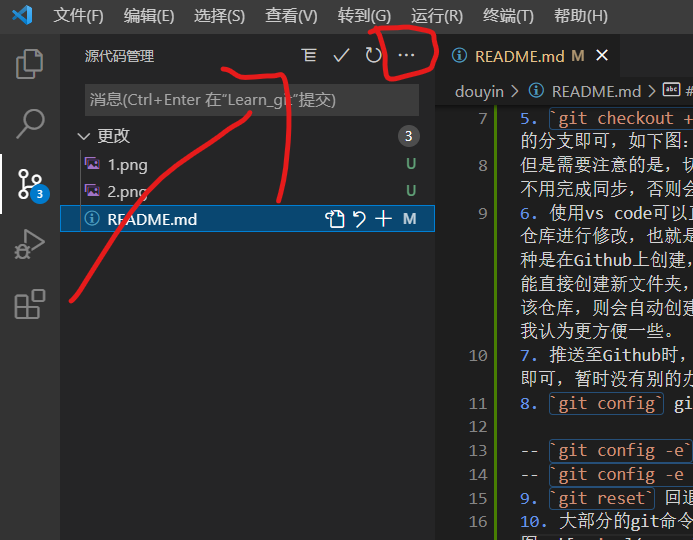
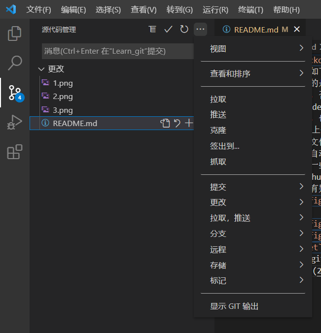
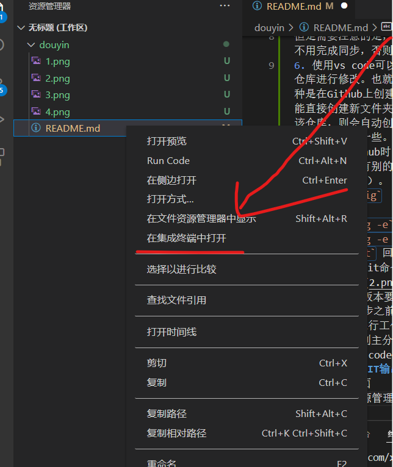

### Git学习

#### 常见问题与命令

1. 删除某一次提交记录，使用`git rebase -i + 哈希地址 或者 tag` ，但是删除后会出现冲突，需要根据命令行提示解决冲突，才能删除成功。
2. `git branch -a` 查看本地以及远程分支
3. `git branch -d + 分支名` 删除分支，但是需要先切出待删除分支
4. `git remote prune origin` 同步远程分支到本地，用于远程仓库删掉分支后本地还存在的情况
5. `git checkout + 分支名` 切换分支，vs code 直接点击右下角的分支即可，如下图：
但是需要注意的是，切换分支之前必须要在当前分支完成提交，可以不用完成同步，否则会覆盖当前分支。
6. 使用vs code可以直接创建新的代码仓库，也能拉取已存在的代码仓库进行修改。也就是说创建一个代码仓库编写代码有两种方式，一种是在Github上创建，然后在本地clone对应代码仓库，开始工作。也能直接创建新文件夹，初始化git，编写好直接提交推送，如果不存在该仓库，则会自动创建，个人建议创建新的代码仓库，采用第二种，我认为更方便一些。
7. 推送至Github时，经常会报错，因为连接不上了，等一段时间重试即可，暂时没有别的办法。设置代理可能能成功，还未尝试（前提是有vpn的情况下）。
8. `git config`  git本地设置命令
- `git config -e` 设置当前仓库   
- `git config -e global` 设置全局配置，即所有仓库   
9. `git reset` 回退版本
10. 大部分的git命令能实现的操作，vs code都能直接使用，如下图：
11. 当有重要版本要发布之前，打上版本标记，标记功能在上图中，commit之后同步之前打上标记，标记如：v1.0
12. 使用git进行工作时，首先创建自己的分支，在分支上工作，测试无误后再合并到主分支上
13. 部分在vs code上没有的操作需要在终端运行，打开终端的方法：
- 点击**显示GIT输出**，在上面git功能列表中，最下面一行，然后切换到终端页面
- 也可以在资源管理器中右键文件，点击在集成终端中打开，如下图

14. `git log --pretty=oneline` 查看精简的日志
15. `git push origin :分支名` 同步删除远程分支，注意:后无空格 

附上git学习网站：
1. [菜鸟教程](https://www.runoob.com/git/git-tutorial.html)
2. [git教程-廖雪峰](https://www.liaoxuefeng.com/wiki/896043488029600)
3. [vs code上git使用教程](https://cloud.tencent.com/developer/article/1662720)

